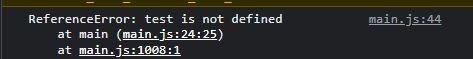
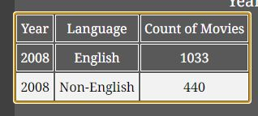

# The Movie Dashboard Data Visualisation
[The Movie Dashboard](https://shane-donlon.github.io/pp2-data-vis/) is an interactive, and responsive dashboard page to visualise movie data from 2000 to 2013 visualising 17,986 movies.
 

 To note: there seems to be an issue between JavaScript and the Am I responsive website which is causing the charts to not appear in the above screenshots.  
## Technologies Used:

- [HTML](https://en.wikipedia.org/wiki/HTML)
- [CSS](https://en.wikipedia.org/wiki/CSS)
- [Javascript](https://en.wikipedia.org/wiki/JavaScript)
- [D3.js library](https://d3js.org/)
- [Chart.js library](https://en.wikipedia.org/wiki/Chart.js)
- [Anime.js library](https://animejs.com/)
- [Google fonts](https://fonts.google.com/)
- [Font awesome](https://fontawesome.com/)

## User stories:
- As a first-time user, I want it to be apparent the purpose of the Website, and is clear on how to use. 
- As a first-time user, I want to see the titles of each chart to easily understand what data I am analysing.
- As a user of the Website, I want to analyse data as well as get high level overviews.
- As a mobile device user, I want a minimal version of the website for high level overviews only.
- As an accessible user I want to be able to skip navigations and recurring content by choice.
- As an accessible user I want to be able to access the data in tabular format.
- As a recurring accessible user I want my accessibility preferences saved to improve my experience.
- As a user I want my reduced motion preferences adhered to.

## Features:
- Loading Screen:
  
  Loading screen appears while content is loading, within the JavaScript I used the eventListener "load" as oppposed to "DomContentLoaded" as I wanted the JavaScript file to render also.
  There is a slight animation on the "o" that is in the shape of a doughnut chart style.
  
  https://github.com/Shane-Donlon/pp2-data-vis/assets/130906067/3047cf80-e770-4fa1-9233-a936bac612aa

- Error Screen:
  
  
  

  In the event that a user does receive an error the error message has instructions on what actions to take (refresh page) and if that continues to fail, there is a call to action within the error(mail:to link)
  The error is also intentinoally logged to the console. I remvoed the error details from the screen as to not include "technical jargon" to the user.

  
- Selection Change
  
  
  
  The ::selection pseudo-element has also been updated, as this improves contrast ratio, as the standard "royalblue" selection did not provide enough contrast

- Reduced Motion
  As you can see in the below video that the counters increment, but if the user has a prefers reduced motion set, these do not increment and are instead static.
  As the numbers increment this would of course leave a poor user expierence for screenreaders as if a screenreader is counting incremenet would be very confusing, an aria-label with the value is added to each card, as aria-label will take priority over the numbers displayed.
  <ul>
  <li>
    If the user has a preference set for reduced motion, the animations are
    slowed down, and overall animation is reduced. This is to reduce animations
    that can make users nauseous (vestibular dysfunction) to test this in Chrome
  </li>
  <ol>
    <li>Go to Inspect</li>
    <li>Select the 3 dots beside the X for close</li>
    <li>Select “Run command”</li>
    <li>Search for “Reduced”</li>
    <li>Click the “Do not emulate CSS prefers-reduced-motion”</li>
    <li>
      Refresh the page, and you will notice that the animation does not run.
    </li>
    <li>To undo this open the site in a new tab.</li>
  </ol>

  
https://github.com/Shane-Donlon/pp2-data-vis/assets/130906067/dd781308-8cf7-4057-a11c-eb75184a9398

- Tooltips

  
  The below tool tips were custom build using JavaScript functions as the standard Chart.JS tooltips did not accurately convey a summary of the data shown

  The line chart hover tool tip - which highlights the year, and number of movies released

  

  The bar chart hover tool tip which highlights the movie genre and the number of movies released

  

  The scatterplot chart hover tool tip

  

- Skip to Content link

  When tabbing through the site the user will be preseneted with a skip to content link which bypasses the header section and is linked to  `<main>`

  
- Accessibility Preferences
When tabbling through the site the user will be presented with accessibility settings, in which they are turn these on or off as needed.
the settings are saved in local storage so that for returning users the preferences are saved.
If the user either enables or disables the tables, the radio button will be presented with the alternate option
IE If the user has accessibility tables enabled the radio will display "off", and if the user has the accessibliity tables disabled the radio will display "on".
  

  

  

 Each chart has an accessilbity table which will update as the charts update:

  Data table on load:

  
  

  Date table on update:

  
  
- Chart Drill-down
  Each chart has a drill-down "slider" option which on input will filter the data to the year and prodcue an updated chart.
  the `<input>` type for range was used here as it controls both the charts and the data tables, and I did not include click events on the `<canvas>` element intionally as to give the same expierence. When the chart slider is moved the current filtered year is presented, as well as the chart title is updated accorindly.

  
 

For the intital movies by year line chart, on input this updates to a bar chart that drills down into the genres of movies for the current year.

  
 Also for desktop each individual card is updated on input change.

 
 

 Movies by language chart:
 

 Chart when updated:

  
Scatterplot on laod:
 

Scatterplot on update:

- Mobile users
  

As mobile phones have limited capability compared to desktop / laptop on mobile there are only a few features, this is to preserve "real-estate" for the mobile phone, but also the primary purpose of the site is a dashboard and the data should be telling the story here, for this reason I have only included the charts in the mobile version, the images, image animations, and cards are not displayed on mobile devices and the site is pared back to almost the minimum viable product.
On mobile devices the dashboard can still be filtered by year, this functionality has not been removed.

## Testing:
Some tests will be marked as N/A as they cannot be tested (eg tabbing)

| Testing Number  | Testing Description  |Result Chrome   |Result Chrome Mobile   | Result Firefox  | Result Firefox Mobile  |Result Safari Tablet   |
|---|---|---|---|---|---|---|
| 1  | Website Loads  | Pass  | Pass  | Pass  | Pass  | Pass  |
| 2 | Loading Screen Appears  | Pass  | Pass  | Pass  | Pass  | Pass  |
| 3 |Error Screen Appears (on error only)  | Pass  | Pass  | Pass  | Pass  | Pass  |
| 4 |Increment counter does not run prefers reduced motion   | Pass  | Pass  | Pass  | Pass  | Pass  |
| 5 |  Accessibility Tables on tab | Pass  | N/A  | Pass  |  N/A   |  N/A   |
| 6  | Accessibility Tables preferences saves  | Pass  | N/A  | Pass  |  N/A   |  N/A   |
| 7  | Accessibility Tables load without reloading the page  | Pass  | N/A  | Pass  |  N/A   |  N/A   |
| 8 | Skip to content link works  | Pass  | N/A  | Pass  |  N/A   |  N/A   |
| 9  | Input ranges adjust chart 1  | Pass  | Pass  | Pass  | Pass  | Pass  |
| 10  | Input ranges adjust chart 2  | Pass  | Pass  | Pass  | Pass  | Pass  |
| 11 | Input ranges adjust chart 3  | Pass  | Pass  | Pass  | Pass  | Pass  |
| 12  | Input ranges adjusts accessibility tables 1  | Pass  | N/A  | Pass  |  N/A   |  N/A   |
| 13  | Input ranges adjusts accessibility tables 2  | Pass  | N/A  | Pass  |  N/A   |  N/A   |
| 14  | Input ranges adjusts accessibility tables 3  | Pass  | N/A  | Pass  |  N/A   |  N/A   |
| 15  | Input ranges adjust chart title 1  | Pass  | Pass  | Pass  | Pass  | Pass  |
| 16  | Input ranges adjust chart title 2  | Pass  | Pass  | Pass  | Pass  | Pass  |
| 17 | Input ranges adjust chart title 3  | Pass  | Pass  | Pass  | Pass  | Pass  |
| 18  | Input ranges adjust chart year output tag chart 1 | Pass  | Pass  | Pass  | Pass  | Pass  |
| 19  | Input ranges adjust chart year output tag chart 2  | Pass  | Pass  | Pass  | Pass  | Pass  |
| 20 | Input ranges adjust chart year output tag chart 3  | Pass  | Pass  | Pass  | Pass  | Pass  |
| 21 | Input ranges adjusts all cards (input 1) | Pass  | Pass  | Pass  | Pass  | Pass  |
| 22 | Input ranges adjusts all cards (input 2)  | Pass  | Pass  | Pass  | Pass  | Pass  |
| 23 | Input ranges adjusts all cards (input 3)  | Pass  | Pass  | Pass  | Pass  | Pass  |
| 24 | Monster Animation runs | Pass  | N/A  | Pass  |  N/A   |  N/A   |
| 25 |images appear | Pass  | N/A  | Pass  |  N/A   |  N/A   |
| 26  | Data source website opens in new tab | Pass  | Pass  | Pass  | Pass  | Pass  |
|   |   |   |   |   |   |   |
|   |   |   |   |   |   |   |
|   |   |   |   |   |   |   |
|   |   |   |   |   |   |   |
|   |   |   |   |   |   |   |
|   |   |   |   |   |   |   |
|   |   |   |   |   |   |   |
|   |   |   |   |   |   |   |
|   |   |   |   |   |   |   |
|   |   |   |   |   |   |   |
